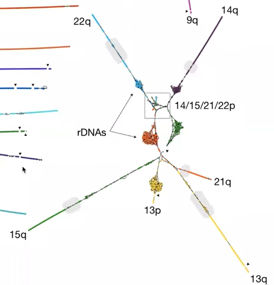

# 1. Unfinished human genome
    

    
 
    
>5% is missing or incorrect in current GRCH38, which are hard to pinpoint because GRCH38 is made from a number of individuals
    
it was a back-based hierarchical project and there’s no real original sample material that we can go back to validate that initial reconstructure is correct
    
show here in this ideogram, look in the blue regions, which are large blocks of heterochromatin unknown
    

    
# 2. A new era of sequencing
    

    

    
this isn’t long encough to span the super long repeats, but if you think about a human genome between the haplotypes, there’s a variant maybe every 10 kb or so that;s within the span of a HiFi read , you can link those variants together and phase haplotypes
    
# 3. Finishing the human genome
    
we had one goal in mind to finish the human genome, we weren’t too focused on costs or how long it would take
    
<aside>
    💡 we just wanted to get the job done
</aside>
    
the reason of chosing **CHM13**
    
> they’re formed when a haploid sperm fertilizes an egg that has lost its genome
>   
> the sperm then spontaneously duplocates its genome resulting in essentially a fully **homozygous diploid genome**
>
> so this removes the challenges of heterozygosity

we took what I affectionately call the kitchen sink approach where we just spent all the time and money that we could to collect as much data as possible
    

    
## 3.1. early efforts: use nanopore ultroleng reads only
        

        
each of the horizontal black and gray bands represents a contig and I’m switching the color anytime there’s a gap
        
these white regions are regions are still missing from the current reference
        
this was obviously a three billon dollar multi-years effort 
        

        
this is all of our ultra-long data run through Canu and the assembly as it is straight out of the assembler
        
so wonderful to see the technology advance over the last 20 years, the continued investment in the **DNA sequencing technology**, **algorithm development** and **computational advances**, results in this great improvement to now essentially a near complete genome
        
this was primarily a nanopore based assembly
        
this is what really **gave us hope**, there’s only 100 or so gaps here, what if we just put in a little extra effort and looked very closely at those gaps would be able to close them
        
the first one that we took a look at was the gap basically at the centromere on the chrX
        
one of the surprising findings from our recent ability to finish these centromeres is that there is **variation within the centromeres**, a little more than people expected
        

        

        
we’re now actually able to pinpoint the location of essentially the functional centromere
        
now we can assemble the whole satellite array, we can actually pinpoint the sequence that is **the site of kinetochore assembly**, by CENP-A ChIP-seq
        
which corresponds a dip in methylation, a **region of hypomethylation**
        
But both of those projects, took **a year or more** a very **focused effort** to build the nanopore assembly by kind of tiling across, validating it, annotating it

<aside>
❓ Can we speed this up
</aside>
    
## 3.2. adavanced efforts: PacBio HiFi & Nanopore UL

A graph-first approach

 - HiFi string graph
 
    Homopolymer compression (CAAAAT → CAT)
            
    > back by HiFi, nanopore or 454 reads, tend to miscall homopolymer
    >
    > so we simply ignore it by taking all of the homopolymers compressing down to a single base
    >
    > come bach at the end of the process and expand them back out again
        
    Read cleaning and correction

    > looking at pipeups of reads that are overlapping to identify single base errors
            
    String graph from long perfect overlaps
            
    > the past string graph have been a little fuzzy or noisy that you allow some amount of error between the reads, because the sequencing reads themselves contail error
    >
    > the HiFi reads are so good that after homopolymer compression
 
- Hamiltonian walks for easy tangles
- Nanopore walks for hard tangles
- Use only HiFi for consensus (decompression)
        
about a year ago to this day, Sergey was showing me his first HiFi string graph for CHM13
        

        
there’s a few things of this graph that initially stuck out to us
        
- most of the chromosomes are individual component
            
    we know that some of the alpha satellite arrays are similar between different chromosomes, but we didn’t really know how similar
            
    they are not similar encough to cause a problem when you’re doing these HiFi graph, they actually separate out into nice individual components
            
    they have been separated on those chromosomes long encough in evolutionary time to build up encough mutations that you can distinguish them from one another
            
- most of the structure of this graph is linear, there is not a lot of nasty tangles
    
    color those by the chromosomes that they originate from, you get these nice kind of linear reconstructions
            
    
            
    highlighted in gray, the location of the centromeric satellite arrays
    
    the vast majority of the tangly parts of the genome localized to those satellite DNA arrays
    
    these tiny arrows here marked breaks in the chromosome, where the string graph is not continuous
    
    that is actually due to coverage dropouts in the HiFi data, which currently has a bit of a bias in GA rich sequences

if I zoom in a couple of those tangles, kind of fall out into two categories
    
- The good
    
    

- The bad
        
    
        
- The worst of worst: acrocentric chromosomes
        
    
        
    
        
    the centromere is positioned very close to the p arm of the chromosome
        
strategy to solve those tangles
        

        
# 4. The complete seqence of human genome, and validation

one of the easiest way to show the quality of the assembly, is to map all of the reads backs to it, and show that they map uniformly across all regions of the genome

you will notice a couple of **coverage anomalies**, there is an increase in HiFi coverage, and a corresponding decrease in ONT

it turns out that these coverage anomalies are not assembly errors, they’re actually due to **sequencing biases** in both PacBio and ONT in human satellite repeats

PacBio in some cases finds it much easier to sequence human satellite 2 and 3 than nanopore, and in fact the coverage is elevated in those regions

the nanopore data has a counter effect in some case here, in human satellite 1 you can see a decrease in the nanopore coverage
