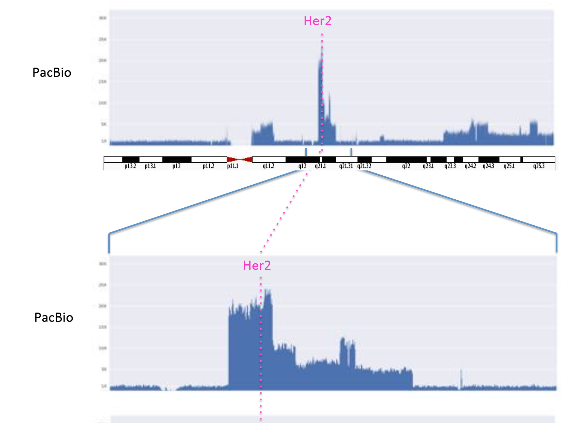
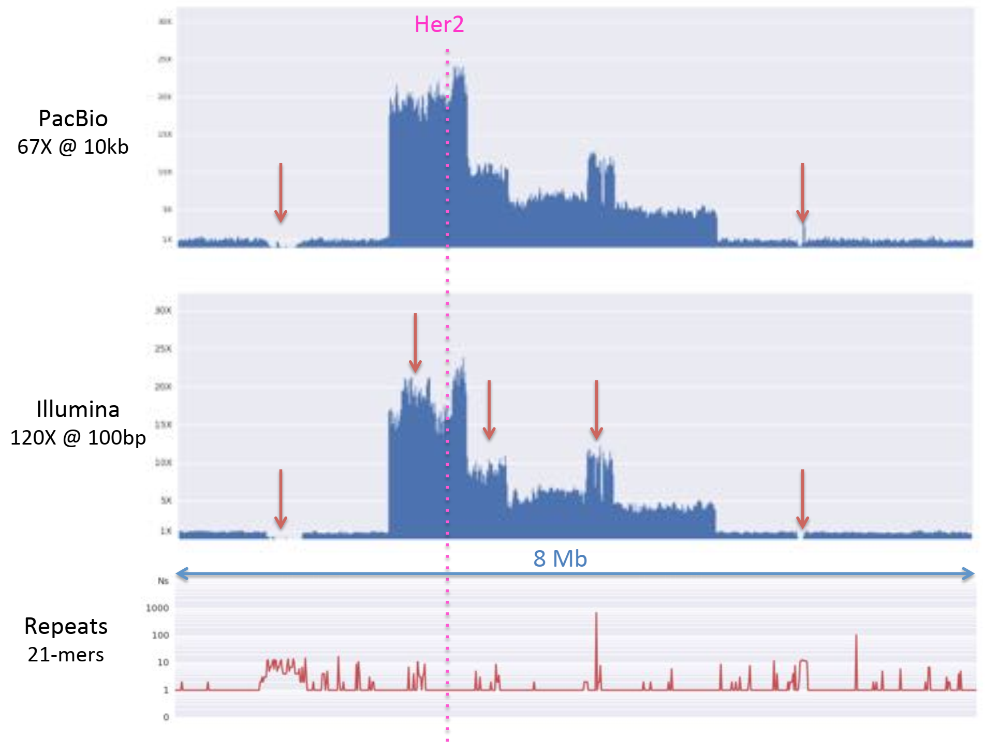

# Assembly theory

## Assembling a Genome
        

        
Why are genomes hard to assemble?
        
1. Biological

    (Very) High ploidy, heterozygosity, repeat content

2. Sequencing

    (Very) large genomes, imperfect sequencing

3. Computational

    (Very) Large genomes, complex structure

4. Accuracy

    (Very) Hard to assess correctness
        
Detangle graph with long reads, mates, and other links
        

        

        

        
## De Bruijn and Overlap graph

        
## Ingredients for a good assembly
        

- Coverage

    Typical sequencing coverage
  
    

    

    

    

    

    

- Read Length

    Coverage and Read Length

    

- Error

    

    

- Repeats composition

    

    

    
# Whole Genome Alignment & visualization

Goal of WGA

> For two genomes, A and B, find a mapping from each position in A to its corresponding position in B
>
> 

Not so fast...

> Genome A may have insertions, deletions, translocations, inversions, duplications or SNPs with respect to B (sometimes all of the above)
>
> 

WGA visualization

> 
>
> 
>
> 
>
> 

# Genome assemblers

## ALLPATHS-LG: recommended for Illumina-only projects

## Celera Assembler: recommended for PacBio projects

### Assembly Complexity

### Long Read Sequencing Technology

- Moleculo Sequencing

    Clever library preparation technique to turn a short read sequencer into a quazi-long read sequencer

    

    
  
- PacBio SMRT Sequencing

    Imaging of fluorescently phospholinked labeled nucleotides as they are incorporated by a polymerase anchored to a Zero-Mode Waveguide (ZMW)

    

- Oxford Nanopore MinION

    
   
### Consensus Accuracy and Coverage

# Application: Her2 amplified breast cancer

SK-BR-3: Most commonly used Her2-amplified breast cancer cell line

<aside>
❓ Can we resolve the complex structural varia4ons, especially around Her2?
</aside>

Improving SMRTcell Performance

## Structural variant discovery with long reads

PacBio and Illumina coverage values are highly correlated but Illumina shows greater variance because of poorly mapping reads

Confirmed both known gene fusions in this region

Joint coverage and breakpoint analysis to discover underlying events

Cancer lesion Reconstruction

## Oncogene Analysis

